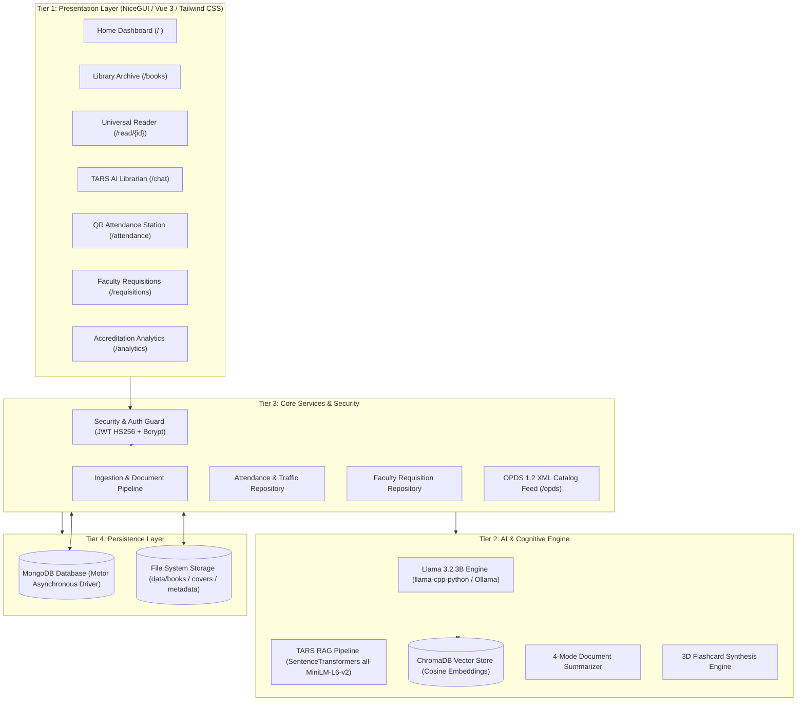

# 📚 Libre-Library
### Intelligent Library Management, E-Learning Archive & AI Research Workstation

<div align="center">


**North Eastern Mindanao State University (NEMSU) — Tandag Campus**  
*Department of Computer Studies | CS 413: Software Engineering 2*  
**Research Team:** Emmanuel Amista • Kieser Loren • Kenneth Pañares • Josepito Quezada  
**Adviser:** Dr. Cherly B. Sardovia  

[System Overview](#-system-overview) • [Academic Objectives](#-academic-srs-alignment) • [Key Modules](#-core-system-modules) • [HCI Principles](#-hci--cognitive-design-system) • [Architecture](#-4-tier-rad-architecture) • [Getting Started](#-getting-started) • [Testing](#-automated-testing-suite) • [OPDS Catalog](#-opds-12-e-reader-feed)

</div>

---

## 🌟 System Overview

**Libre-Library** is a self-hosted, offline-capable digital library and academic learning workstation engineered to modernize institutional library operations. It bridges physical resource management with cutting-edge artificial intelligence, integrating:

1. **Multi-Format Academic Ingestion & Reading**: High-fidelity support for PDF, EPUB, DOCX, PPTX, and TXT with in-browser viewers and persistent reading progress tracking.
2. **Autonomous Local AI Companion (TARS)**: 100% private, on-premise Retrieval-Augmented Generation (RAG) powered by ChromaDB vector embeddings and local Llama 3.2 3B weights—ensuring zero student data leakage to external cloud APIs.
3. **High-Speed QR Entrance Attendance**: Sub-second camera QR/barcode scanner logging daily foot traffic, dwell duration, and visit purposes.
4. **Faculty Curriculum Requisition Portal**: Syllabus-driven textbook acquisition system with a visual 5-stage procurement lifecycle stepper.
5. **Institutional Accreditation Analytics**: Program-level utilization metrics, hourly doorway heatmaps, and automated LLM-generated accreditation narrative summaries (CHED/AACCUP ready).
6. **Pedagogical Tools**: 4-mode AI document summarizer and automated 3D flashcard generator.

---

## 🎓 Academic SRS Alignment (Chapters 1 & 2)

Developed in accordance with the Software Requirement Specifications (SRS) for CS 413 Software Engineering 2 at NEMSU Tandag Campus:

| Specific Objective (Ch. 1) | Functional Requirement (Ch. 2) | System Implementation |
| :--- | :--- | :--- |
| **S.O. 1: Multi-Format Ingestion** | **FR 1: Document Processing & Vectorization** | Multi-threaded parser for PDF, EPUB, DOCX, PPTX, TXT with automated cover extraction and ChromaDB embedding indexing. |
| **S.O. 2: RAG & Socratic AI Librarian** | **FR 6: Intelligent Pedagogical Assistance** | Local Llama 3.2 3B model streaming with cosine vector search citations, Socratic teaching mode, and scoped document analysis. |
| **S.O. 3: Doorway Traffic Automation** | **FR 3: QR Attendance & Traffic Management** | Camera QR scanner (`html5-qrcode`), barcode gun support, sub-second check-in/out toggling, visit purpose tagging, and CSV export. |
| **S.O. 4: Faculty Requisitions & Analytics** | **FR 4: Book Requisition & FR 5: Analytics** | Faculty coursebook acquisition portal with procurement tracking and department utilization heatmaps. |
| **S.O. 5: Evaluation & Quality Benchmarks** | **FR 7: RBAC & NFR 1–6: Performance** | 4-tier Role-Based Access Control (`student`, `faculty`, `librarian`, `admin`), JWT authentication, and 59/59 automated tests passing. |

---

## 🏗️ 4-Tier RAD Architecture

Libre-Library adheres to a 4-Tier Rapid Application Development (RAD) architectural pattern:



---

## 🚀 Core System Modules

### 1. 📖 Universal Reader & Document Ingestion ([`/upload`](file:///c:/Users/User/Desktop/Libre-Library/ui/pages/upload.py) & [`/read/{id}`](file:///c:/Users/User/Desktop/Libre-Library/ui/pages/reader_interface.py))
* **Format Support**: Interactive PDF iframe viewer, EPUB.js reader, structured DOCX reading mode, PPTX slide carousel, and responsive TXT prose viewer.
* **Persistent Progress Tracking**: Automatically tracks active reading position, page numbers, and completion percentages in MongoDB.
* **Ingestion Hub**: Drag-and-drop file uploader with real-time terminal logs, cover extraction, and post-upload next action ribbons.

### 2. 🤖 TARS AI Librarian & RAG Pipeline ([`/chat`](file:///c:/Users/User/Desktop/Libre-Library/ui/pages/chat.py))
* **100% Offline & Private**: Zero cloud dependency; inference executes locally using quantized Llama 3.2 3B weights.
* **Scoped Document Retrieval**: Chat with the entire library catalog or constrain retrieval to a single textbook or research paper.
* **Citation Chips**: Every AI assertion references exact document sources and page passages.
* **Socratic Teaching Mode**: Toggles between direct answers and thought-provoking guided inquiry for active student learning.

### 3. 🎫 QR Doorway Attendance & Digital Pass ([`/attendance`](file:///c:/Users/User/Desktop/Libre-Library/ui/pages/attendance.py))
* **Sub-Second Scanning ($< 0.2\text{s}$)**: Real-time camera scanner (`html5-qrcode`) and high-speed hardware barcode gun input.
* **Smart Toggle**: Automatically alternates between Check-In and Check-Out, computing dwell duration per visitor.
* **Purpose of Visit Chips**: Categorizes entrance by Study / Review, Research, Book Borrowing, Computer Use, or Leisure.
* **Personal Digital Pass**: Instant SVG/PNG QR pass generation for students using their Student ID.
* **Data Export**: 1-click CSV download of daily entrance logs for institutional record-keeping.

### 4. 📋 Faculty Book Requisition Portal ([`/requisitions`](file:///c:/Users/User/Desktop/Libre-Library/ui/pages/requisitions.py))
* **Curricular Alignment**: Professors submit course textbook requests with Course Code, Department, ISBN, and Justification.
* **5-Stage Visual Stepper**: Clear lifecycle progression: `Pending Review` $\rightarrow$ `Approved` $\rightarrow$ `In Procurement` $\rightarrow$ `Available in Library` (or `Declined`).
* **Librarian Administrative Controls**: Librarians review, approve, reject, and update purchase orders with internal notes.

### 5. 📊 Institutional Utilization & AI Analytics ([`/analytics`](file:///c:/Users/User/Desktop/Libre-Library/ui/pages/analytics.py))
* **Academic Program Heatmap**: Tracks foot traffic across BSCS, BSIT, BSED, BSBA, BSN, and other colleges.
* **Hourly Foot-Traffic Distribution**: Hourly bar chart from 8:00 AM to 5:00 PM identifying doorway peak congestion.
* **TARS AI Accreditation Synthesis**: Generates formal multi-paragraph accreditation narratives summarizing utilization trends for CHED and AACCUP evaluation visits.

### 6. 🧠 Study Planner & 3D Interactive Flashcards ([`/planner`](file:///c:/Users/User/Desktop/Libre-Library/ui/pages/planner.py))
* **Automated Deck Synthesis**: LLM analyzes uploaded lecture notes or textbooks to generate active recall decks in 15 seconds.
* **3D Perspective Flip**: Responsive cards with 3D animation (`perspective: 1000px`), question front-face, and answer back-face.
* **Keyboard & Touch Ergonomics**: Full navigation with Left/Right arrows and Spacebar flip.

### 7. 📑 AI Document Summarizer ([`/summarizer`](file:///c:/Users/User/Desktop/Libre-Library/ui/pages/summarizer.py))
* **4 Pedagogical Modes**:
  1. *Exhaustive Study Guide*: Comprehensive chapter-by-chapter breakdowns.
  2. *Executive Overview*: High-yield 2-minute summary.
  3. *Key Concepts & Definitions*: Technical glossary of terms and formulas.
  4. *Q&A Active Recall Prep*: Test questions and model answers.
* **1-Click Persistence**: Direct saving of generated summaries into the book's permanent metadata record.

---

## 🎨 HCI & Cognitive Design System

The user interface was built strictly adhering to **10 Foundational Human-Computer Interaction (HCI) and Psychological Laws**:

1. **Fitts's Law**: Primary buttons and interactive cards feature $\ge 44\text{px}$ touch zones, easily acquired on mobile viewports.
2. **Von Restorff Effect**: Primary actions utilize vibrant Royal Indigo accents against neutral Slate surfaces for clear visual hierarchy.
3. **Miller's Law**: Dashboard quick actions are chunked into 4 balanced pillars; filter options are structured into digestible groups.
4. **Aesthetic-Usability Effect**: Glassmorphism navigation (`backdrop-blur-md`), rounded corners (`rounded-2xl sm:rounded-3xl`), and cohesive Slate borders create a trustworthy, premium experience.
5. **Peak-End Rule**: Workflows conclude with clear celebratory feedback ribbons (e.g., upload action ribbons, scan celebration badges).
6. **Jakob's Law**: Standardized top navigation, keyboard shortcuts (`/` search focus), breadcrumbs, and user dropdowns match mental models from standard web applications.
7. **Zeigarnik Effect**: The dashboard prominently features a **"Continue Reading"** card with real-time percentage bars (`Page X of Y`), motivating task resumption.
8. **Law of Proximity**: Related metadata chips and filter controls are clustered together with coherent padding and spacing.
9. **Tesler's Law**: Complex file parsing, reading duration estimates, and token streaming are absorbed by the system rather than offloaded to the user.
10. **Hick's Law**: Progressive disclosure separates primary actions ("Read Now") from secondary options ("Download", "Edit Metadata").

---

## 💻 Tech Stack

| Category | Technology | Purpose |
| :--- | :--- | :--- |
| **Frontend Framework** | [NiceGUI](https://nicegui.io/) (FastAPI + Quasar + Vue 3) | Real-time reactive Python web interface |
| **Styling** | Tailwind CSS + Quasar UI | Cohesive, responsive light theme design system |
| **Database** | [MongoDB](https://www.mongodb.com/) via [Motor](https://motor.readthedocs.io/) | Asynchronous persistence for books, logs, and users |
| **Vector Engine** | [ChromaDB](https://www.trychroma.com/) | Persistent vector database for RAG embeddings |
| **Embeddings** | `SentenceTransformers` (`all-MiniLM-L6-v2`) | High-speed offline semantic text vectorization |
| **Local LLM** | Meta Llama 3.2 3B Instruct (`llama-cpp-python` / Ollama) | Localized, private generative AI inference |
| **Authentication** | `python-jose` (JWT) + `bcrypt` | Stateless signed tokens and salted password hashing |
| **Barcode/QR** | `qrcode` + `html5-qrcode` | Sub-second camera scanning and student pass generation |
| **E-Reader Feed** | OPDS 1.2 (Atom XML) | Wireless catalog synchronization for external e-readers |

---

## 📁 Repository Directory Structure

```plaintext
Libre-Library/
├── assets/                          # Application graphics, logos, and branding
├── components/                      # Reusable UI component modules
│   ├── book_card.py                 # Book card with Zeigarnik progress bar
│   ├── bottom_nav.py                # Mobile glassmorphic bottom navigation dock
│   ├── chat_floating.py             # Floating TARS quick-chat FAB
│   ├── header.py                    # Glassmorphism header with RBAC user menu
│   └── sidebar.py                   # Desktop navigation drawer with campus links
├── core/                            # Core backend logic & services
│   ├── ai_engine/                   # AI & LLM integration layer
│   │   ├── llm_engine.py            # Local Llama-3.2 runner & streaming pipeline
│   │   └── rag_pipeline.py          # ChromaDB semantic query & context injection
│   ├── auth/                        # Authentication & session layer
│   │   └── jwt_handler.py           # JWT token issuance, verification & route guards
│   ├── config.py                    # Pydantic Settings & environment configuration
│   ├── database/                    # Database repositories & connection manager
│   │   ├── mongo_manager.py         # Asynchronous MongoDB coordinator facade
│   │   └── repositories/            # Domain-driven repositories
│   │       ├── attendance_repository.py   # Sub-second QR attendance logs & stats
│   │       ├── book_repository.py         # Catalog metadata, shelves & searches
│   │       ├── chat_repository.py         # Conversational history & sessions
│   │       ├── planner_repository.py      # Study tasks, milestones & decks
│   │       ├── progress_repository.py     # Persistent user reading progress
│   │       ├── requisition_repository.py  # Faculty book requisitions & lifecycle
│   │       └── user_repository.py         # User profiles, student IDs & RBAC roles
│   ├── external_api/                # External protocols & catalog feeds
│   │   └── opds_router.py           # OPDS 1.2 XML catalog feed for e-readers
│   ├── services/                    # Domain business logic
│   │   └── ingestion_service.py     # Document processing, chunking & RAG indexing
│   └── utils/                       # Utility helpers & text extractors
│       └── text_extractor.py        # Multi-format document extractor (PDF/EPUB/DOCX/PPTX)
├── data/                            # Persistent runtime storage (git-ignored)
│   ├── books/                       # Organized book directories & physical files
│   └── chroma_db/                   # Chroma vector database indices
├── models/                          # Local GGUF quantized model weights
├── static/                          # Static web assets & EPUB.js reader engine
├── tests/                           # Automated unit test suite (59/59 passing)
│   ├── test_auth.py                 # Authentication, JWT & bcrypt password tests
│   ├── test_config.py               # Security key generation, paths & CORS origins
│   ├── test_rag.py                  # ChromaDB query caching, chunking & scoped retrieval
│   ├── test_security.py             # Path traversal guards & input sanitization
│   ├── test_services.py             # Ingestion, summarizer & planner service tests
│   ├── test_srs_modules.py          # QR attendance, requisitions & RBAC tests
│   └── test_text_extractor.py       # Multi-format document extraction tests
├── tools/                           # Standalone maintenance & administrative CLI tools
│   ├── cleanup_bad_data.py          # Cleans corrupt/placeholder metadata records
│   ├── fix_authors.py               # Normalizes author fields across library records
│   ├── force_migrate.py             # Force-indexes book files into MongoDB
│   ├── manage_users.py              # User account listing & deletion utility
│   └── verify_system.py             # Pre-flight system check utility
├── ui/                              # User interface views and theme
│   ├── pages/                       # Application route pages
│   │   ├── admin.py                 # Admin console & RBAC role manager
│   │   ├── analytics.py             # Accreditation analytics & AI narrative
│   │   ├── attendance.py            # QR attendance scanner & digital pass
│   │   ├── auth.py                  # Login & registration forms
│   │   ├── book_collection.py       # Library catalog with filters & infinite scroll
│   │   ├── book_details.py          # Book synopsis, cover & reading actions
│   │   ├── chat.py                  # Full-page TARS conversational assistant
│   │   ├── home.py                  # Dashboard, greeting, statistics & quick actions
│   │   ├── planner.py               # Study planner, milestones & 3D flashcards
│   │   ├── profile.py               # User profile, student ID & reading pass
│   │   ├── reader_interface.py      # E-reader interface (EPUB, PDF, DOCX, PPTX)
│   │   ├── requisitions.py          # Faculty book requisition portal
│   │   ├── summarizer.py            # AI study guide & chapter summarizer
│   │   └── upload.py                # Document Ingestion Hub & real-time log
│   └── theme.py                     # Light theme system & Inter typography
├── main.py                          # NiceGUI application entrypoint & route map
├── requirements.txt                 # Pinned project dependencies
└── start_app.bat                    # Windows one-click startup & launcher
```

---

## 🚀 Getting Started

### 1. Prerequisites
* **Python**: `3.11` or `3.12`
* **MongoDB Community Server**: Running locally on `mongodb://localhost:27017`
* **Git**: Installed
* *(Optional)* **NVIDIA GPU with CUDA**: For accelerated LLM inference

### 2. Installation & Setup

1. **Clone the repository**:
   ```bash
   git clone https://github.com/K1ezy/Kieser-s-Libre-Library.git
   cd Libre-Library
   ```

2. **Create and activate a virtual environment**:
   ```powershell
   # Windows (PowerShell)
   python -m venv .venv
   .\.venv\Scripts\Activate.ps1
   ```

3. **Install dependencies**:
   ```powershell
   pip install -r requirements.txt
   ```

4. **Start MongoDB Service**:
   ```powershell
   net start MongoDB
   ```

5. **Run the Application**:
   ```powershell
   python main.py
   ```
   *The application will launch at `http://localhost:8080`.*

6. **First-Time Administrator Registration**:
   * Navigate to `http://localhost:8080/signup`.
   * The first registered user is automatically provisioned with **Administrator** role privileges.
   * Subsequent signups can choose between **Student** or **Faculty Member**.

---

## 🧪 Automated Testing Suite

Libre-Library includes an end-to-end unit test suite validating authentication, vector retrieval, document extraction, security guards, and all academic SRS modules:

```powershell
# Run the complete test suite:
python -m unittest discover tests/
```

**Output:**
```plaintext
Ran 59 tests in 13.866s

OK (59/59 passing)
```

### Test Suite Structure
* `tests/test_srs_modules.py`: QR code generation, sub-second attendance processing, 5-stage requisition lifecycle, and RBAC role promotion.
* `tests/test_auth.py`: Salted bcrypt password hashing, JWT token creation, and expiration handling.
* `tests/test_rag.py`: ChromaDB vector indexing, cosine similarity querying, and query caching.
* `tests/test_security.py`: Path traversal protection, alphanumeric ID sanitization, and filesystem containment.
* `tests/test_text_extractor.py`: Plain text, markdown, PDF, DOCX, and PPTX parsing.
* `tests/test_services.py`: Document ingestion, chunking, and AI summarization service logic.

---

## 📡 OPDS 1.2 E-Reader Feed

Libre-Library features an integrated **Open Publication Distribution System (OPDS)** catalog server:
* **Endpoint**: `http://<your-server-ip>:8080/opds`
* **Compatible Applications**:
  * **KOReader** (Kindle, Kobo, Android, Linux)
  * **Moon+ Reader** (Android)
  * **Apple Books** (iOS, iPadOS, macOS)
  * **Chunky Comic Reader** (iPadOS)
* **Functionality**: Live book discovery, cover thumbnails, author browsing, and direct single-click wireless EPUB/PDF download to e-ink and mobile devices.

---

## 👥 Academic Credits & Research Team

* **Institution:** North Eastern Mindanao State University (NEMSU) — Tandag Campus
* **Academic Program:** Bachelor of Science in Computer Science (BSCS-4C)
* **Course:** CS 413 — Software Engineering 2
* **Research Team:**
  * **Emmanuel Amista**
  * **Kieser Loren**
  * **Kenneth Pañares**
  * **Josepito Quezada**
* **Project Adviser:** **Dr. Cherly B. Sardovia**

---

## 📜 License

This project is licensed under the **MIT License**. Free for personal, academic, and non-commercial institutional use.
