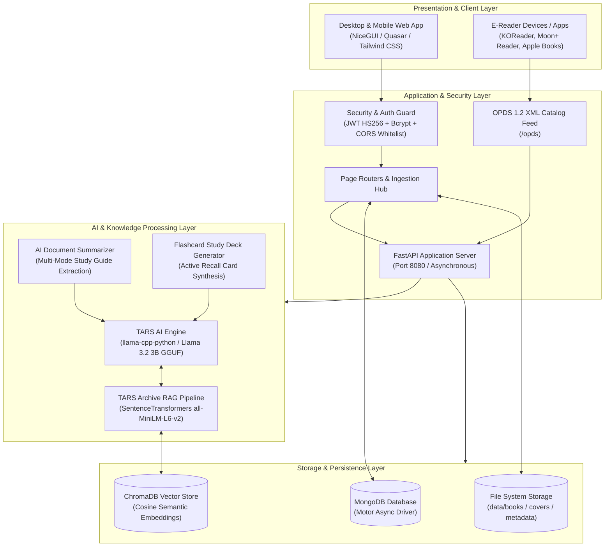

# 📚 Libre-Library

<div align="center">


**Intelligent, AI-Powered Personal Digital Library, E-Reader & Study Companion**  
*Private, Offline-First, and Zero Data Leakage.*

[Features](#-key-features) • [Architecture](#-system-architecture) • [Directory Structure](#-folder--file-architecture) • [Quickstart](#-getting-started) • [OPDS Catalog](#-opds-12-e-reader-catalog-feed) • [Testing](#-automated-testing-suite) • [Contributing](#-contributing) • [Changelog](#-changelog--quality-of-life-improvements)

</div>

---

## 🌟 Overview

**Libre-Library** is a self-hosted personal digital library and learning workstation. It integrates a reading interface with local **Retrieval-Augmented Generation (RAG)** artificial intelligence. Users can organize, read, search, summarize, and study their books and documents without relying on external cloud APIs or leaking personal data.

Built on an asynchronous Python stack using **NiceGUI** (FastAPI + Quasar + Vue 3 + Tailwind CSS), **MongoDB** (Motor), and **ChromaDB**, Libre-Library provides a clean, coherent light aesthetic optimized for desktop workstations, tablets, and mobile devices (iPhone / Android) alike.

---

## 🏗️ System Architecture



---

## ✨ Key Features

### 🤖 Local AI & RAG Engine (TARS Librarian)
- **100% Private Offline Inference**: Powered by local quantized models (default: `Llama-3.2-3B-Instruct-Q8_0.gguf`) running on GPU/CPU via `llama-cpp-python` with zero telemetry.
- **Semantic Vector Retrieval (RAG)**: Uses ChromaDB and `all-MiniLM-L6-v2` Sentence Transformers to index, retrieve, and cite exact page passages from your documents.
- **Thread-Safe Query Caching**: In-memory LRU query cache prevents redundant embedding computations and accelerates repeated questions.
- **Lazy Initialization**: ChromaDB and embedding weights load on-demand, preventing slow cold boot times.
- **Multimodal Audio & Accessibility**: Integrated 1-click clipboard copy and Web Speech text-to-speech audio synthesis.

### 📱 Mobile-First Ergonomics
- **Bottom Navigation Dock (`md:hidden`)**: A glassmorphic bottom dock anchored above the device home indicator using safe-area insets (`env(safe-area-inset-bottom, 0px)`).
- **Dynamic Viewport Heights (`100dvh`)**: Replaced fragile `100vh` units with `100dvh`, preventing mobile address-bar shifts and bounce glitches on iOS Safari and Chrome.
- **Horizontal Swipe Status Chips**: Reading status tabs (All, Favorites, Currently Reading, Want to Read, Completed) feature native horizontal swipe physics (`-webkit-overflow-scrolling: touch`).
- **Two-Column Responsive Filters**: Collapses multi-filter select toolbars into 2 compact columns on phones, cutting vertical scrolling in half.
- **iOS Auto-Zoom Suppression**: Enforces `font-size: 16px` on form inputs to prevent intrusive browser auto-zoom.
- **Floating Chat FAB Safe Clearance**: Floating TARS action button is offset to float safely above the mobile bottom dock.

### 🎨 Clean, Coherent Light Design System
- **Complete Dark Mode Purge**: Fully eradicated conflicting dark mode styles, legacy night-time auto toggles, and Quasar `.body--dark` class injections.
- **System Color Scheme Lock**: Declared `<meta name="color-scheme" content="light">` to instruct mobile operating systems not to force-invert colors.
- **Curated Palette**:
  - **Canvas**: Clean Slate 50 (`#f8fafc`)
  - **Surfaces**: Crisp White (`#ffffff`) with subtle Slate 200 borders (`#e2e8f0`)
  - **Primary**: Royal Indigo (`#4f46e5` / `#4338ca`)
  - **Typography**: High-contrast Slate 900 (`#0f172a`) headings and Slate 700 (`#334155`) body

### 📡 OPDS 1.2 E-Reader Catalog Feed
- **Built-in Catalog Server**: Exposes an Atom/XML OPDS feed at `/opds`.
- **E-Reader Wireless Sync**: Connect physical e-readers (Kobo, Kindle via KOReader) or mobile apps (Moon+ Reader, Apple Books, Chunky) directly over local Wi-Fi to browse, search, and download your books.
- **Automatic Cover & Acquisition Links**: Generates standard OPDS image and download links for PDF, EPUB, DOCX, and PPTX formats.

### 📖 Universal Reader Interface
- **Native Document Support**: Clean reading viewers for EPUB, PDF, DOCX, PPTX, TXT, and Markdown.
- **Reading Progress & Status**: Tracks reading progress, last page read, and categorized shelves in MongoDB.
- **Metadata Resolution**: Automatically resolves local book paths, cover images, and publication data.

### 🧠 Study Planner & 3D Flashcards
- **Topic & Milestone Tracker**: Create, track, and manage study goals and target completion dates.
- **AI Flashcard Synthesis**: Automatically generates active-recall study flashcard decks from any document in **10–25 seconds**.
- **Interactive 3D Carousel**: Responsive flashcard cards with 3D flip animation (`perspective: 1000px`), question front-face, and answer back-face.

### 📑 Document Summarizer
- **4 Pedagogical Modes**:
  1. *Exhaustive Study Guide*: Multi-chapter in-depth breakdown.
  2. *Executive Overview*: High-yield concise brief.
  3. *Key Concepts & Definitions*: Glossary and core formulas/theories.
  4. *Q&A Active Recall Prep*: Test questions and model answers.
- **Direct Book Record Persistence**: 1-click saving of generated summaries into the book's MongoDB document.

### 🔐 Enterprise Security & Hardening
- **Path Traversal Guards**: Strict alphanumeric regex checks and resolved path confinement (`is_relative_to`) prevent directory traversal attacks.
- **Cryptographic Key Generation**: Auto-generates persistent 256-bit entropy keys (`secrets.token_urlsafe(32)`) saved to `data/.secret_key`.
- **Password Security**: Salted `bcrypt` hashing with case-insensitive, whitespace-sanitized credential handling.
- **JWT Expiry Enforcement**: Stateless HS256 tokens with configurable expiration and session verification.
- **Restricted CORS Policy**: Explicitly restricts origins to localhost, local LAN IPs, and authorized ngrok tunnels.

---

## 📂 Folder & File Architecture

```plaintext
Libre-Library/
├── .github/                         # GitHub workflows, issue & PR templates
│   ├── workflows/ci.yml             # Automated testing matrix (Python 3.11/3.12 on Linux & Windows)
│   ├── ISSUE_TEMPLATE/              # Structured bug report & feature request forms
│   └── pull_request_template.md     # Standardized PR submission checklist
├── assets/                          # Application graphics, icons, and branding
├── components/                      # Reusable UI component modules
│   ├── book_card.py                 # Responsive book display card with format chips
│   ├── bottom_nav.py                # Mobile glassmorphic bottom navigation dock
│   ├── chat_floating.py             # Floating TARS quick-chat FAB & drawer modal
│   ├── header.py                    # Glassmorphism top navigation & mobile search dialog
│   └── sidebar.py                   # Desktop navigation drawer with profile footer
├── core/                            # Core backend logic & services
│   ├── ai_engine/                   # AI & LLM integration layer
│   │   ├── llm_engine.py            # Local Llama-3.2 runner & streaming pipeline
│   │   └── rag_pipeline.py          # ChromaDB semantic query & context injection
│   ├── auth/                        # Authentication & session layer
│   │   └── jwt_handler.py           # JWT token issuance, verification & session helpers
│   ├── config.py                    # Pydantic Settings & environment configuration
│   ├── database/                    # Database connection & repository layer
│   │   └── mongo_manager.py         # Motor asynchronous MongoDB manager
│   ├── external_api/                # External protocols & catalog feeds
│   │   ├── dbooks_manager.py        # External book catalog search integration
│   │   └── opds_router.py           # OPDS 1.2 XML catalog feed for e-readers
│   ├── services/                    # High-level domain services
│   │   └── ingestion_service.py     # Document processing, chunking & RAG indexing
│   └── utils/                       # Utility & extraction helpers
│       ├── metadata_scraper.py      # Automated cover & synopsis enrichment
│       └── text_extractor.py        # Multi-format document text extractor (PDF/EPUB/DOCX/PPTX)
├── data/                            # Persistent runtime application data (git-ignored)
│   ├── books/                       # Organized book directories & physical files
│   └── chroma_db/                   # Chroma vector database indices
├── E-Books/                         # Ingest directory for incoming e-books
├── models/                          # Local GGUF quantized model weights
├── static/                          # Static web assets & EPUB.js reader engine
├── tests/                           # Automated unit test suite (22/22 passing)
│   ├── __init__.py                  # Test package definition
│   ├── test_auth.py                 # Authentication, JWT & bcrypt password tests
│   ├── test_config.py               # Security key generation, paths & CORS origins
│   ├── test_rag.py                  # ChromaDB query caching, chunking & scoped retrieval
│   ├── test_security.py             # Path traversal guards & input sanitization
│   └── test_text_extractor.py       # Multi-format document extraction tests
├── tools/                           # Standalone maintenance & administrative CLI tools
│   ├── cleanup_bad_data.py          # Cleans corrupt/placeholder metadata records
│   ├── debug_library.py             # MongoDB & file system diagnostics
│   ├── debug_loader.py              # Native document extractor test harness
│   ├── filescanner.py               # Codebase structure analyzer
│   ├── fix_authors.py               # Metadata author cleaning script
│   ├── force_migrate.py             # Force-indexes book files into MongoDB
│   ├── gpu_test.py                  # CUDA / llama-cpp GPU engine validation
│   ├── manage_users.py              # User account listing & deletion utility
│   ├── migrate_library.py           # Legacy directory migration script
│   ├── organize_ebooks.py           # E-Books folder organizer & repair
│   ├── pack_for_gemini.py           # Context packing utility for LLM analysis
│   └── test_imports.py              # Dependency import validator
├── CONTRIBUTING.md                  # Development environment, guidelines & PR workflow
├── SECURITY.md                      # Security vulnerability reporting & architecture policy
├── ui/                              # User interface views and theme
│   ├── pages/                       # Application route pages
│   │   ├── admin.py                 # Admin console & OPDS catalog feed link
│   │   ├── auth.py                  # Login & registration forms
│   │   ├── book_collection.py       # Library catalog with filters & infinite scroll
│   │   ├── book_details.py          # Book synopsis, cover & reading actions
│   │   ├── chat.py                  # Full-page TARS conversational assistant
│   │   ├── home.py                  # Dashboard, greeting, statistics & quick actions
│   │   ├── planner.py               # Study planner, milestones & flashcards
│   │   ├── planner_service.py       # Flashcard synthesis service
│   │   ├── profile.py               # User profile & reading statistics
│   │   ├── reader_interface.py      # E-reader interface (EPUB, PDF, DOCX, PPTX)
│   │   ├── summarizer.py            # AI study guide & chapter summarizer
│   │   └── upload.py                # Document Ingestion Hub & real-time log
│   └── theme.py                     # Light theme system, Inter typography & CSS rules
├── download_model.py                # Script to download Llama 3.2 GGUF weights
├── main.py                          # NiceGUI application entrypoint & route map
├── requirements.txt                 # Pinned project dependencies
├── smart_librarian.py               # Metadata synchronization tool
└── start_app.bat                    # Windows one-click startup & ngrok launcher
```

---

## 🚀 Getting Started

### 1. Prerequisites
- **Python**: 3.11 or 3.12
- **MongoDB Community Server**: Running locally on `localhost:27017`
- **Git**: Installed
- *(Optional)* **NVIDIA GPU with CUDA**: For accelerated LLM inference

### 2. Installation & Setup

1. **Clone the repository**:
   ```bash
   git clone https://github.com/K1ezy/Kieser-s-Libre-Library.git
   cd Libre-Library
   ```

2. **Create and activate a virtual environment**:
   ```bash
   # Windows (PowerShell)
   python -m venv .venv
   .venv\Scripts\Activate.ps1
   ```

3. **Install dependencies**:
   ```bash
   pip install -r requirements.txt
   ```

4. **Download the local AI model**:
   ```bash
   python download_model.py
   ```
   *Downloads `Llama-3.2-3B-Instruct-Q8_0.gguf` into the `models/` directory.*

5. **Start MongoDB**:
   ```powershell
   net start MongoDB
   ```

---

## 🖥️ Running the Application

### Option A: One-Click Startup (Windows)
Double-click `start_app.bat` or run:
```bat
start_app.bat
```
*Starts Libre-Library on port `8080` and optionally initializes an `ngrok` tunnel for remote mobile access.*

### Option B: Manual Command Line
```bash
python main.py
```
- Open `http://localhost:8080` in your web browser.
- **First-Time Setup**: Register at `/signup`. The first registered user is automatically granted **Administrator** status.

---

## ⚙️ Configuration (`core/config.py`)

All settings can be configured via environment variables or a `.env` file:

| Variable | Default Value | Description |
|---|---|---|
| `PROJECT_NAME` | `Libre Library` | Web application display title |
| `MONGO_URI` | `mongodb://localhost:27017` | MongoDB connection URI |
| `DB_NAME` | `libre_library_db` | Main database name |
| `SECRET_KEY` | *(Auto-generated 256-bit)* | Session cookie encryption secret |
| `JWT_SECRET` | *(Auto-generated 256-bit)* | JWT signing key |
| `ACCESS_TOKEN_EXPIRE_MINUTES` | `1440` (24 Hours) | JWT access token lifespan |
| `UI_THEME_COLOR` | `#4f46e5` | Primary Indigo brand color |
| `MODEL_FILENAME` | `Llama-3.2-3B-Instruct-Q8_0.gguf` | Active LLM weights filename in `models/` |
| `GPU_LAYERS` | `20` | Layers offloaded to CUDA GPU (`-1` for full offload) |
| `CONTEXT_WINDOW` | `8192` | LLM context token window |

---

## 📡 OPDS 1.2 E-Reader Catalog Feed

Libre-Library includes an **OPDS (Open Publication Distribution System)** catalog:
- **URL**: `http://<your-ip-or-domain>:8080/opds`
- **Supported E-Readers**:
  - **KOReader** (Kindle / Kobo / Android / Linux)
  - **Moon+ Reader** (Android)
  - **Apple Books** (iOS / iPadOS)
  - **Chunky Comic Reader** (iPadOS)
- **Features**: Live search feed, category grouping, publication date sorting, high-resolution cover art, and direct EPUB/PDF download.

---

## 🧪 Automated Testing Suite

Libre-Library includes a unit test suite verifying core system components:

```bash
# Run all automated tests:
python -m unittest discover tests

# Run specific test modules:
python -m unittest tests.test_auth
python -m unittest tests.test_config
python -m unittest tests.test_rag
python -m unittest tests.test_security
python -m unittest tests.test_text_extractor
```

### Test Coverage Highlights
- `tests/test_auth.py`: Password hashing, token generation, role verification, and expiration handling.
- `tests/test_config.py`: Dynamic secret key generation, persistent storage, and CORS origins validation.
- `tests/test_rag.py`: ChromaDB initialization, query caching, text chunking, and lazy loading.
- `tests/test_security.py`: Alphanumeric ID sanitization, path traversal blocking, and filesystem containment.
- `tests/test_text_extractor.py`: Plain text, markdown, and multi-format document extraction.

---

## 🛠️ CLI Management Utilities

Administrative and maintenance tools are organized under the `tools/` directory:

```bash
# Account Management
python tools/manage_users.py list      # List registered accounts and roles
python tools/manage_users.py delete    # Wipe accounts to re-initialize admin account

# Data Integrity & Metadata
python tools/cleanup_bad_data.py       # Scan and clean corrupted/placeholder metadata
python tools/fix_authors.py            # Normalize author fields across library records
python tools/force_migrate.py          # Force index physical book files into MongoDB
python tools/gpu_test.py               # Validate CUDA / llama-cpp GPU offload
```

---

## 📋 Changelog & Quality of Life Improvements

### 1. 🛡️ Security & Stability Refactoring (Tier 1–3)
- **Directory Traversal Protection**: Hardened file access in the reader interface with path normalization and `is_relative_to` verification.
- **Dynamic Cryptographic Secrets**: Replaced static keys with auto-generated 256-bit entropy keys stored in `data/.secret_key`.
- **CORS Whitelist**: Locked down allowed origins to localhost, local LAN subnets, and verified ngrok domains.
- **Safe Date Normalization**: Created `to_timestamp()` to eliminate datetime comparison crashes during catalog sorting.
- **Architectural Cleanup**: Reorganized 11 loose diagnostic scripts into `tools/`.

### 2. ⚡ Performance & Scalability
- **Vector Query Caching**: Added thread-safe caching to `TarsArchive` to avoid redundant embedding calculations.
- **Lazy Initialization**: ChromaDB and SentenceTransformer models initialize on first access rather than blocking application startup.
- **I/O Worker Offloading**: Document extraction offloaded to background threads using `run.io_bound`, keeping the UI responsive.
- **Indexed MongoDB Queries**: Added compound and sparse indexes on user and document collections.

### 3. 📱 Mobile-First Responsive Redesign
- **Bottom Navigation Dock**: Glassmorphism dock (`components/bottom_nav.py`) with safe-area insets (`env(safe-area-inset-bottom, 0px)`).
- **Viewport Stabilization**: Adopted `100dvh` units and disabled pull-to-refresh overscroll bounce.
- **Touch-Friendly Controls**: Added horizontal swipe status chips (`touch-pan-x`) and compact 2-column mobile filter selects.
- **Floating Chat FAB Positioning**: Offset quick-chat button to clear the mobile bottom navigation bar.

### 4. 🎨 Coherent Light Theme & Dark Mode Purge
- **Complete Dark Mode Removal**: Eradicated all `dark:` classes, Quasar `body--dark` styles, and legacy night-time toggles.
- **Meta Color Scheme Lock**: Enforced `<meta name="color-scheme" content="light">` to prevent mobile OS auto-inversion.
- **Unified Design System**: Cohesive Slate 50 background, crisp white cards, Slate 900 typography, and Royal Indigo accents.

### 5. 🧠 Study Planner & Summarizer Enhancements
- **Fast Flashcard Synthesis**: Optimized prompt chunking to generate complete flashcard decks in **10–25 seconds**.
- **3D Card Flip**: Carousel cards with 3D perspective flip effects and touch support.
- **Multi-Mode Summarizer**: 4 study guide modes with 1-click MongoDB document persistence.

### 6. 🖼️ Universal Book Cover Engine & Preview Lightbox
- **Cross-Format Extraction**: High-fidelity front cover rendering for PDF (PyMuPDF), EPUB (metadata raster + SVG fallback), PPTX (slide 1 thumbnail), and TXT/DOCX (typographic cover generation with PIL).
- **100% Cover Coverage**: Batch cover generation and synchronization tool (`tools/generate_all_covers.py`) ensuring no placeholder silhouettes.
- **Cover Preview Modal**: 1-click high-resolution cover preview lightbox on document details pages with smooth fade/scale animations.

### 7. ⌨️ Complete Keyboard Accessibility System
- **Vim / Reader Smooth Scrolling**: Smooth viewport control with `j`/`k` (line step), `d`/`u` (half page), `Space`/`Shift+Space`, `gg` (top), and `G` (bottom).
- **Two-Key Chord Navigation**: Instant navigation across routes with `g` chords (`g h` Home, `g b` Books, `g c` Chat, `g s` Summarizer, `g p` Planner, `g u` Profile).
- **Universal Search & Shortcut Overlay**: Quick search focus via `/`, modal escape via `Escape`, and modal cheat sheet triggered via `?`.
- **WCAG High-Contrast Focus Rings**: Custom accessibility focus indicators adhering to WCAG 2.1 AAA guidelines.

### 8. 🏛️ Domain Repository Architecture & Service Layer Deconstruction
- **God Object Elimination**: Dissected monolithic `MongoManager` (1,037 lines) into 5 focused domain repositories (`BookRepository`, `ChatRepository`, `PlannerRepository`, `ProgressRepository`, `UserRepository`), with a backwards-compatible coordinator facade.
- **AI Domain Services**: Decoupled presentation from AI coordination by extracting `ChatService` (RAG orchestration, prompt building, intent parsing, markdown export) and `SummarizerService` (multi-stage chunking, study prompt engineering).
- **Expanded Test Suite**: Added 19 comprehensive unit tests bringing the suite to **41/41 passing tests**.

---

## 🤝 Contributing & Community

Contributions are welcome! Whether you are reporting a bug, proposing a new feature, or submitting code improvements:

- Read our **[Contributing Guide](CONTRIBUTING.md)** for development setup, architecture conventions, and PR workflow.
- Review our **[Security Policy](SECURITY.md)** for responsible disclosure and security principles.
- Use our structured **[Issue Templates](.github/ISSUE_TEMPLATE/)** when submitting bugs or feature requests.

---

## 📜 License

This project is licensed under the **MIT License**. Free for personal, academic, and non-commercial use.
