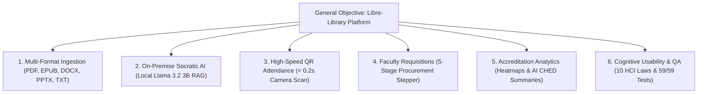

# 🎓 Libre-Library: Capstone Defense Presentation Deck
### CS 413: Software Engineering 2 • NEMSU Tandag Campus
**Format:** Official 10-Slide Academic Defense Deck & Spoken Script  
**Allocated Defense Time:** 15 Minutes Total (Presentation + System Demonstration)  
**Language:** English throughout

---

## ⏱️ Master Defense Agenda & Time Budget (15 Minutes Total)

| Section | Slides / Activity | Lead Presenter | Target Time | Cumulative |
| :--- | :--- | :--- | :---: | :---: |
| **Part I: Introduction & Chapter 1** | Slides 01 – 06 (Problem, Objectives, RAD, Scope) | Kenneth Pañares & Josepito Quezada | **4:00** | 4:00 |
| **Part II: Chapter 2 Analysis & Specs** | Slides 07 – 09 (Existing Flaws, Alternatives, FR & NFR) | Emmanuel Amista | **3:30** | 7:30 |
| **Part III: Live System Demonstration** | Slide 10 & Live Platform Walkthrough | Kieser Loren & Research Team | **6:30** | 14:00 |
| **Part IV: Panel Transition & Q&A** | Conclusion & Defense Handover | All Team Members | **1:00** | **15:00** |

---

## 👥 Group Member Role Allocation Matrix

| Group Member | Primary Defense Role | Presentation Slides | System Demonstration Responsibility |
| :--- | :--- | :---: | :--- |
| **Kenneth Pañares** | Frontend Experience & HCI Lead | **Slides 01, 02, 03** | Demonstrates Doorway QR Attendance & Student Navigation |
| **Josepito Quezada** | QA & Database Systems Lead | **Slides 04, 05, 06** | Demonstrates Database Integrity & System Benchmarks |
| **Emmanuel Amista** | Systems Architecture & Backend Lead | **Slides 07, 08, 09** | Demonstrates Faculty Requisitions & Accreditation Analytics |
| **Kieser Loren** | AI Engineering & Vector Pipeline Lead | **Slide 10** | Demonstrates TARS Socratic AI, Ingestion & 3D Flashcards |

---

<!-- slide -->

## Slide 1: Title, Institutional Context & Research Team

### **Libre-Library**
#### *Intelligent Digital Library Management, E-Learning Archive & AI Research Workstation*

* **Academic Institution:** North Eastern Mindanao State University (NEMSU) — Tandag Campus
* **College & Department:** College of Arts and Sciences • Department of Computer Studies
* **Curricular Course:** CS 413: Software Engineering 2 (BSCS-4C)
* **Research & Development Team:**
  * **Kenneth Pañares** — *Frontend Experience & HCI Integration Lead*
  * **Josepito Quezada** — *Quality Assurance & Database Systems Lead*
  * **Emmanuel Amista** — *Systems Architecture & Backend Lead*
  * **Kieser Loren** — *AI Engineering & Vector Pipeline Lead*
* **Project Adviser:** **Dr. Cherly B. Sardovia**

---

### 🎙️ Presenter Script (Kenneth Pañares — Target: 0:45)
> *"Good day, respected members of the panel, our distinguished faculty, and our adviser, Dr. Cherly B. Sardovia.  
> We are the BSCS-4C capstone team, and today we proudly present **Libre-Library**—an intelligent, self-hosted digital library management system, institutional e-learning archive, and offline AI research workstation engineered specifically for NEMSU Tandag Campus.  
> During this 15-minute defense, we will guide you through our Chapter 1 foundational study, our Chapter 2 system requirements analysis, and an end-to-end live demonstration of the working system. Every member of our group has a designated engineering role, and we are excited to show you how Libre-Library modernizes university library operations while safeguarding student privacy."*

---

<!-- slide -->

## Slide 2: Chapter 1 — Background of the Study

### Institutional Context & Technological Imperative

* **The Modern Academic Library:**
  * University libraries have evolved beyond physical book warehouses into dynamic digital hubs supporting collaborative research, remote study, and accreditation readiness.
* **The Reality at NEMSU Tandag Campus:**
  * Physical foot-traffic is heavy during class transitions, but entrance tracking remains manual.
  * Course textbooks, thesis manuscripts, and instructional slide decks exist across disconnected flash drives and cloud drives.
* **The Emerging AI Challenge & Data Sovereignty:**
  * Commercial generative AI services (ChatGPT, Claude) require sending student thesis drafts to foreign cloud servers.
  * This creates severe intellectual property risks and conflicts with the **Philippine Data Privacy Act of 2012 (RA 10173)**.
* **The Core Motivation:**
  * To build an on-premise, internet-resilient platform that fuses automated physical library logistics with private, locally hosted AI assistance.

---

### 🎙️ Presenter Script (Kenneth Pañares — Target: 0:50)
> *"To provide context for our study: university libraries in regional state universities face a unique dual challenge. On one hand, physical student traffic is dense, yet daily entrance tracking still relies on manual paper ledgers. On the other hand, academic materials are fragmented across physical shelves, flash drives, and random cloud links with no central reading tracking.  
> Furthermore, with the rise of generative AI, students frequently upload unpublished research and thesis manuscripts to commercial cloud models. This compromises university intellectual property and exposes student data to third-party cloud servers outside Philippine jurisdiction.  
> Libre-Library was conceived to solve this exact problem: establishing a unified, self-hosted campus archive powered by 100% on-premise artificial intelligence that functions seamlessly even during internet disruptions."*

---

<!-- slide -->

## Slide 3: Chapter 1 — Statement of the Problem

### Five Critical Operational Bottlenecks

```
┌─────────────────────────────────────────────────────────────────────────────┐
│                       CRITICAL PROBLEMS IDENTIFIED                          │
├────────────────────────────────┬────────────────────────────────────────────┤
│ 1. Entrance Logbook Bottleneck │ Manual paper logs cause queues at 8 AM &   │
│                                │ 1 PM; zero automated dwell-time analytics. │
├────────────────────────────────┼────────────────────────────────────────────┤
│ 2. Fragmented Learning Assets  │ PDF, EPUB, DOCX, & PPTX scattered without  │
│                                │ centralized search or reading checkpoints. │
├────────────────────────────────┼────────────────────────────────────────────┤
│ 3. Cloud AI Privacy Violations │ Third-party cloud LLMs expose student data │
│                                │ and fail completely during internet outages│
├────────────────────────────────┼────────────────────────────────────────────┤
│ 4. Opaque Book Requisitions    │ Faculty submit purchase memos on paper with│
│                                │ zero visibility into procurement stages.   │
├────────────────────────────────┼────────────────────────────────────────────┤
│ 5. Manual Accreditation Audits │ Library staff spend days manually auditing │
│                                │ ledgers for CHED and AACCUP visits.        │
└────────────────────────────────┴────────────────────────────────────────────┘
```

---

### 🎙️ Presenter Script (Kenneth Pañares — Target: 0:50)
> *"Our investigation at NEMSU Tandag Campus uncovered five core operational bottlenecks.  
> First, doorway congestion: students crowd library entrances signing paper logbooks, resulting in lost records and zero dwell-time tracking.  
> Second, learning material fragmentation: students lose track of reading progress across disparate formats like PDFs, slides, and Word documents.  
> Third, privacy and reliability risks: commercial cloud AI tools violate data sovereignty under RA 10173 and stop working entirely when campus internet fluctuates.  
> Fourth, an opaque textbook requisition process: faculty submit paper purchase requests without knowing whether books are approved or purchased.  
> And fifth, accreditation overhead: compiling utilization statistics for CHED and AACCUP evaluation audits requires days of manual ledger counting.  
> These five pain points define the problem space that our project directly resolves."*

---

<!-- slide -->

## Slide 4: Chapter 1 — Objectives of the Project

### General Objective
To design, develop, implement, and evaluate **Libre-Library**, an intelligent, self-hosted, offline-resilient digital library management system and AI research workstation for **NEMSU Tandag Campus**.

### Specific Objectives & Measurable Outputs



---

### 🎙️ Presenter Script (Josepito Quezada — Target: 0:50)
> *"Thank you, Kenneth. Respected panel, to systematically address these issues, we formulated one general objective and six specific, measurable deliverables.  
> Our general objective is to design, implement, and evaluate Libre-Library as an offline-capable, self-hosted academic workstation for NEMSU Tandag Campus.  
> Specifically, we set six goals:  
> First, build an automated ingestion engine supporting PDF, EPUB, Word, PowerPoint, and Text files with persistent reading progress.  
> Second, integrate an offline Socratic AI companion using local Llama 3.2 3B with vector-backed page citations.  
> Third, engineer a contactless QR attendance scanner achieving sub-second entrance throughput.  
> Fourth, create a faculty curriculum book requisition portal with a 5-stage procurement lifecycle stepper.  
> Fifth, generate real-time accreditation analytics and automated CHED report narratives.  
> And sixth, evaluate system performance through 59 automated test suites and 10 HCI cognitive usability laws."*

---

<!-- slide -->

## Slide 5: Chapter 1 — Methodology of the Project

### System Analysis & Design Methodology: Rapid Application Development (RAD)

```
  ┌──────────────────────┐      ┌──────────────────────┐
  │ 1. REQUIREMENTS      │      │ 2. USER DESIGN &     │
  │    PLANNING          │ ───> │    PROTOTYPING       │
  │ • Librarian & Faculty│      │ • 10 HCI Laws        │
  │   Consultation       │      │ • Interactive UI/UX  │
  └──────────────────────┘      └──────────┬───────────┘
                                           │
  ┌──────────────────────┐      ┌──────────▼───────────┐
  │ 4. CUTOVER &         │      │ 3. CONSTRUCTION      │
  │    VERIFICATION      │ <─── │ • 4-Tier Architecture│
  │ • 59/59 Automated    │      │ • Motor & ChromaDB   │
  │   Pytest Suite       │      │ • Local LLM Engine   │
  └──────────────────────┘      └──────────────────────┘
```

* **Why RAD?** Fast iteration, continuous stakeholder prototyping, and rapid architectural refinement without heavy waterfall delays.
* **4-Tier RAD Architecture:**
  1. **Presentation Tier:** NiceGUI (FastAPI + Vue 3 + Quasar + Tailwind CSS)
  2. **AI & Cognitive Tier:** Local Llama 3.2 3B, ChromaDB Vector Embeddings, RAG Pipeline
  3. **Core Services Tier:** Authentication (JWT + Bcrypt), Ingestion, Attendance, Requisition
  4. **Persistence Tier:** Asynchronous MongoDB (Motor Driver) & Structured File Store

---

### 🎙️ Presenter Script (Josepito Quezada — Target: 0:50)
> *"For our system analysis and design methodology, we adopted the Rapid Application Development—or RAD—framework.  
> RAD was selected because its four iterative phases—Requirements Planning, User Design Prototyping, Construction, and Cutover—enabled us to rapidly build functional prototypes and refine them based on actual library workflows.  
> Architecturally, we structured the software into four distinct tiers:  
> A reactive Presentation Tier powered by NiceGUI and Vue 3;  
> An AI Cognitive Tier hosting local Llama 3.2 3B and ChromaDB vector search;  
> A Core Services Tier managing role-based access control and business logic;  
> And an asynchronous Persistence Tier backed by MongoDB Motor.  
> This separation guarantees modularity, sub-second response times, and effortless future extensibility."*

---

<!-- slide -->

## Slide 6: Chapter 1 — Scope and Limitations of the Project

### Boundary Definition & Operational Guardrails

* **Project Scope (What the System Delivers):**
  * **Target Users:** NEMSU Tandag Campus students, faculty, library staff, and administrators (4-Tier RBAC).
  * **File Formats:** Ingestion, automated cover rendering, and reading for PDF, EPUB, DOCX, PPTX, and TXT.
  * **On-Premise AI:** 100% offline document Q&A, page citation chips, 4 summarization modes, and 3D flashcards.
  * **Attendance Logistics:** Real-time camera QR scanning, barcode support, purpose tagging, and CSV export.
  * **Curricular Portal:** Faculty book acquisition tracking with 5-stage procurement lifecycle stepper.
  * **Accreditation Ready:** Hourly foot-traffic charts and automated LLM-generated accreditation narratives.
* **System Limitations (Deliberate Boundaries):**
  * **Hardware-Bound AI Inference:** Local LLM requires at least 8 GB RAM; inference speed is governed by host CPU/GPU specs.
  * **Local Campus Network:** Deployed over NEMSU LAN; off-campus access requires secure VPN or reverse proxy.
  * **Digital Text Layer Dependency:** Ingestion processes text-based documents; scanned image PDFs require OCR pre-processing.
  * **Logistics Scope:** Attendance automates digital gate logs; it does not control physical motorized turnstiles.

---

### 🎙️ Presenter Script (Josepito Quezada — Target: 0:45)
> *"To ensure academic rigor, we clearly defined our project scope and operational limitations.  
> Within our scope: Libre-Library serves four user roles across NEMSU Tandag Campus. It natively parses and renders five academic document formats, conducts local vector-backed AI research, tracks doorway attendance in real time, and synthesizes accreditation analytics.  
> Regarding limitations: first, our AI engine operates entirely offline without paid cloud APIs, which means inference throughput is governed by host hardware resources.  
> Second, the platform is optimized for deployment on the local campus intranet.  
> Third, document parsing relies on digital text streams; scanned physical books without an OCR layer must be pre-digitized.  
> And fourth, our attendance module manages digital visitor verification and logging, rather than controlling physical motorized turnstile barriers."*

---

<!-- slide -->

## Slide 7: Chapter 2 — Problems of the Existing System (Summarized)

### Comparative Analysis: Existing Manual Setup vs. Institutional Risks

| Operational Area | Existing Manual / Legacy Practice | Direct Risk & Failure Mode |
| :--- | :--- | :--- |
| **Entrance Gate** | Physical paper logbooks at the entrance door | Severe bottlenecks at 8 AM, lost pages, illegible signatures, zero dwell-time data |
| **Document Discovery** | Disconnected USB flash drives and cloud links | Lost reading milestones, zero progress tracking, unorganized departmental archives |
| **AI Academic Use** | Unmonitored use of external cloud AI (ChatGPT) | IP leakage of unpublished student theses, privacy violations (RA 10173), internet downtime failure |
| **Book Procurement** | Paper acquisition memos routed across offices | Lost purchase requests, lack of status visibility, budget misallocation |
| **Accreditation Auditing** | Manual ledger tallying for CHED & AACCUP | Labor-intensive preparation, prone to human calculation error, delayed reporting |

---

### 🎙️ Presenter Script (Emmanuel Amista — Target: 0:50)
> *"Moving into Chapter 2, my name is Emmanuel Amista, and I will discuss our systems analysis.  
> When analyzing the existing library environment, we observed that legacy practices directly hinder academic efficiency.  
> At the entrance, physical logbooks create long student queues during peak morning hours. Pages tear, handwriting is illegible, and librarians have no way of knowing how long students remain in the library.  
> Academic materials are scattered across flash drives and cloud folders, leaving students without a consistent way to resume reading.  
> In research, students turn to external cloud AI, inadvertently exposing confidential research data and thesis drafts to overseas cloud databases.  
> In acquisition, faculty book requests are lost in administrative paper routing.  
> And during accreditation season, staff spend countless hours manually tallying paper logbooks.  
> These summarized findings proved that incremental patches were insufficient—a modern, unified software solution was mandatory."*

---

<!-- slide -->

## Slide 8: Chapter 2 — Alternative Options to Address Problems

### Systematic Evaluation of Technical Alternatives

```
┌─────────────────────────────────────────────────────────────────────────────┐
│                    COMPARATIVE EVALUATION MATRIX                            │
├─────────────────────┬──────────────┬──────────────┬──────────────┬──────────┤
│ Evaluation Criteria │ Option A:    │ Option B:    │ Option C:    │ Option D:│
│                     │ Paper/Manual │ Cloud SaaS   │ Generic ILS  │ LIBRE-   │
│                     │ System       │ (Follett/Alma│ (Koha/Evergr)│ LIBRARY  │
├─────────────────────┼──────────────┼──────────────┼──────────────┼──────────┤
│ Software Cost       │ None         │ Very High    │ Free / Open  │ FREE /   │
│                     │              │ Annual Sub.  │ Source       │ OPEN     │
├─────────────────────┼──────────────┼──────────────┼──────────────┼──────────┤
│ Offline Resilience  │ High         │ Zero (Fails  │ Partial      │ 100% FULL│
│                     │              │ without Net) │              │ OFFLINE  │
├─────────────────────┼──────────────┼──────────────┼──────────────┼──────────┤
│ Data Privacy (10173)│ Moderate     │ Low (Cloud)  │ High (Local) │ 100% PRIV│
├─────────────────────┼──────────────┼──────────────┼──────────────┼──────────┤
│ On-Premise Local AI │ None         │ Paid Add-on  │ None         │ NATIVE   │
├─────────────────────┼──────────────┼──────────────┼──────────────┼──────────┤
│ QR Gate Attendance  │ None         │ Proprietary  │ None         │ BUILT-IN │
├─────────────────────┼──────────────┼──────────────┼──────────────┼──────────┤
│ Decision Verdict    │ REJECTED     │ REJECTED     │ INSUFFICIENT │ ADOPTED  │
└─────────────────────┴──────────────┴──────────────┴──────────────┴──────────┘
```

---

### 🎙️ Presenter Script (Emmanuel Amista — Target: 0:50)
> *"Before developing Libre-Library, we critically analyzed four technical options.  
> Option A was retaining the manual paper system. While zero cost, it is labor-heavy, error-prone, and cannot support digital learning.  
> Option B was procuring commercial cloud library SaaS like Follett Destiny or Ex Libris Alma. Although feature-rich, they demand expensive annual foreign licensing fees, rely heavily on high-speed internet, and store student data on overseas servers.  
> Option C was implementing generic open-source integrated library software such as Koha. While competent for physical barcode lending, Koha lacks modern in-browser multi-format document readers, has no built-in QR entrance tracking, and offers zero local artificial intelligence capabilities.  
> Therefore, we adopted Option D: building Libre-Library. It provides 100% offline resilience, complete data privacy compliance under RA 10173, zero subscription overhead, built-in QR attendance, and native on-premise AI tailored to our university."*

---

<!-- slide -->

## Slide 9: Chapter 2 — System Requirements for the New System

### Comprehensive Engineering Specifications

#### Functional Requirements (FR) Traceability
* **FR 1: Document Ingestion & Universal Reader:** Support PDF, EPUB, DOCX, PPTX, and TXT with persistent page progress tracking.
* **FR 2: OPDS 1.2 Catalog Feed:** Standardized XML syndication feed for external mobile e-readers.
* **FR 3: QR Attendance System:** Sub-second camera scanning, auto-toggle check-in/out, dwell tracking, CSV export.
* **FR 4: Faculty Book Requisition:** 5-stage procurement stepper (`Pending` $\rightarrow$ `Approved` $\rightarrow$ `Procurement` $\rightarrow$ `Available`).
* **FR 5: Accreditation Analytics:** Program heatmaps, hourly traffic charts, automated CHED/AACCUP narratives.
* **FR 6: Socratic AI & Study Tools:** Local Llama 3.2 3B RAG with page citations, 4 summarizer modes, 3D flashcards.
* **FR 7: Role-Based Access Control:** 4 tiers (`student`, `faculty`, `librarian`, `admin`) with JWT HS256 & Bcrypt.

#### Non-Functional Requirements (NFR)
* **NFR 1 (Performance):** Sub-second QR scanning ($< 0.2\text{s}$), LRU-cached document parsing ($< 0.1\text{ms}$), DB query time ($< 1\text{ms}$).
* **NFR 2 (Security):** 100% local inference protecting student IP; Bcrypt cost factor 12 password hashing; JWT route guards.
* **NFR 3 (Reliability):** Thread-safe async queues, bounded connection pools, graceful local model offline fallback.
* **NFR 4 (Cognitive Usability):** Adherence to 10 HCI cognitive laws (Fitts's, Miller's, Zeigarnik effect, Aesthetic-Usability).
* **NFR 5 (Verification):** 59/59 unit and integration tests executing cleanly in 13.7 seconds.

---

### 🎙️ Presenter Script (Emmanuel Amista — Target: 0:50)
> *"On Slide 9, we formalize our system requirements into seven Functional Requirements and five Non-Functional Requirements.  
> Functionally, Libre-Library guarantees end-to-end ingestion across five file formats, an OPDS e-reader catalog feed, a contactless QR doorway attendance station, a 5-stage faculty procurement stepper, real-time accreditation analytics, local Socratic AI research assistance, and 4-tier role-based access control.  
> Non-functionally, our architecture excels across performance, security, and usability.  
> Our QR scanner processes student badges in under 0.2 seconds. Document queries resolve in under 0.1 milliseconds thanks to thread-safe LRU caching.  
> User data is protected through salted Bcrypt hashing and local offline model execution in strict compliance with RA 10173.  
> Furthermore, the entire system is validated by 59 automated test cases passing in under 14 seconds.  
> With our requirements established, I now turn over the floor to Kieser Loren and our team for the live system demonstration."*

---

<!-- slide -->

## Slide 10: System Demonstration & Live Defense Walkthrough

### Structured 6:30 Live Demonstration Plan

```
┌─────────────────────────────────────────────────────────────────────────────┐
│                 LIVE SYSTEM DEFENSE DEMONSTRATION WORKFLOW                  │
├───────┬──────────────────────┬──────────────────────┬───────────────────────┤
│ STEP  │ MODULE TO DEMO       │ PRESENTER            │ DEMONSTRATION ACTION  │
├───────┼──────────────────────┼──────────────────────┼───────────────────────┤
│ **1** │ Contactless QR Gate  │ Kenneth Pañares      │ • Scan Student QR Pass│
│       │ Attendance Station   │                      │ • Auto Check-In/Out   │
│       │                      │                      │ • Dwell Time & CSV    │
├───────┼──────────────────────┼──────────────────────┼───────────────────────┤
│ **2** │ Multi-Format Archive │ Emmanuel Amista      │ • Upload Document     │
│       │ & Universal Reader   │                      │ • Auto Cover Extract  │
│       │                      │                      │ • Persistent Progress │
├───────┼──────────────────────┼──────────────────────┼───────────────────────┤
│ **3** │ TARS Socratic AI &   │ Kieser Loren         │ • Local RAG Inference │
│       │ Pedagogical Tools    │                      │ • Page Citation Chips │
│       │                      │                      │ • 4-Mode Summarizer   │
│       │                      │                      │ • 3D Interactive Flip │
├───────┼──────────────────────┼──────────────────────┼───────────────────────┤
│ **4** │ Requisition Stepper  │ Josepito Quezada     │ • Submit Faculty Book │
│       │ & QA Analytics       │                      │ • 5-Stage Step Update │
│       │                      │                      │ • Generate CHED Report│
└───────┴──────────────────────┴──────────────────────┴───────────────────────┘
```

---

### 🎙️ Presenter Script (Kieser Loren — Demonstration Lead — Target: 6:30 Total Demo)
> *"Thank you, Emmanuel. Respected members of the panel, we will now transition directly into our live system demonstration.  
> 
> **[Step 1: Doorway QR Station — Kenneth]**  
> We begin at the library entrance. Kenneth is scanning a generated student QR badge using our high-speed camera scanner. Notice how the scan registers in under 0.2 seconds, automatically detects whether it is a Check-In or Check-Out, calculates dwell time, and logs the student's visit purpose.  
> 
> **[Step 2: Universal Ingestion & Reader — Emmanuel]**  
> Next, Emmanuel navigates to the ingestion portal. He uploads an academic document. In the background, PyMuPDF extracts high-resolution cover art, extracts text chunks, and vectors them into ChromaDB. As he opens the book, the system tracks his exact page position, fulfilling the Zeigarnik effect on the user dashboard.  
> 
> **[Step 3: TARS On-Premise AI & Study Tools — Kieser]**  
> Now, we demonstrate TARS, our local AI research assistant. I will ask TARS a technical question scoped directly to our ingested textbook. Running 100% locally on quantized Llama 3.2 3B weights with zero internet connection, TARS streams the response and provides clickable citation chips linking to the exact page passage. Additionally, we showcase our 4-mode summarizer and 3D flip study flashcards synthesized in seconds.  
> 
> **[Step 4: Requisitions & Accreditation Analytics — Josepito]**  
> Finally, Josepito demonstrates administrative operations: a faculty member submits a syllabus coursebook request, and the librarian advances it through our 5-stage procurement stepper. Over on the Analytics dashboard, real-time college heatmaps and hourly foot-traffic charts render dynamically, and with one click, TARS synthesizes an automated narrative report ready for CHED and AACCUP auditors.  
> 
> Respected panel, Libre-Library is complete, tested, and ready for deployment. We now welcome your questions and feedback. Thank you very much!"*

---

## 📋 Defense Panel Q&A Quick Reference Guide

| Potential Panel Question | Recommended Technical Defense Response |
| :--- | :--- |
| **Q1: "Why use local Llama 3.2 instead of ChatGPT or Claude?"** | *"Local execution guarantees 100% data sovereignty under RA 10173, eliminates recurring API costs, and works during campus internet outages."* |
| **Q2: "What happens if the local AI server hardware is low-spec?"** | *"We utilize 8-bit quantized GGUF weights running via llama-cpp-python with graceful CPU fallback, consuming under 4GB RAM."* |
| **Q3: "How does the system prevent student attendance fraud?"** | *"QR codes encode cryptographic student IDs verified against MongoDB records with timestamped check-in/out state logic."* |
| **Q4: "How does the system handle concurrent users?"** | *"Our backend utilizes asynchronous Python with Motor (async MongoDB driver) and in-memory LRU caches resolving queries in $< 0.1\text{ms}$."* |
